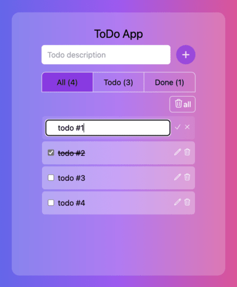

# todo-app



Todo app with persistent storage via browser built-in local storage with React

- add todo / save edit todo - Enter key
- cancel edit todo - Escape key

## Setup

Installing dependencies & devDependencies

```sh
npm install
```

Starting the app

```sh
npm run dev
```

## Dependencies

- [react](https://ghub.io/react): React is a JavaScript library for building user interfaces.
- [react-dom](https://ghub.io/react-dom): React package for working with the DOM.

## Dev Dependencies

- [@types/react](https://ghub.io/@types/react): TypeScript definitions for React
- [@types/react-dom](https://ghub.io/@types/react-dom): TypeScript definitions for React (react-dom)
- [@vitejs/plugin-react-swc](https://ghub.io/@vitejs/plugin-react-swc): Speed up your Vite dev server with SWC
- [autoprefixer](https://ghub.io/autoprefixer): Parse CSS and add vendor prefixes to CSS rules using values from the Can I Use website
- [postcss](https://ghub.io/postcss): Tool for transforming styles with JS plugins
- [prettier](https://ghub.io/prettier): Prettier is an opinionated code formatter
- [prettier-plugin-tailwindcss](https://ghub.io/prettier-plugin-tailwindcss): A Prettier plugin for sorting Tailwind CSS classes.
- [tailwindcss](https://ghub.io/tailwindcss): A utility-first CSS framework for rapidly building custom user interfaces.
- [typescript](https://ghub.io/typescript): TypeScript is a language for application scale JavaScript development
- [vite](https://ghub.io/vite): Native-ESM powered web dev build tool
